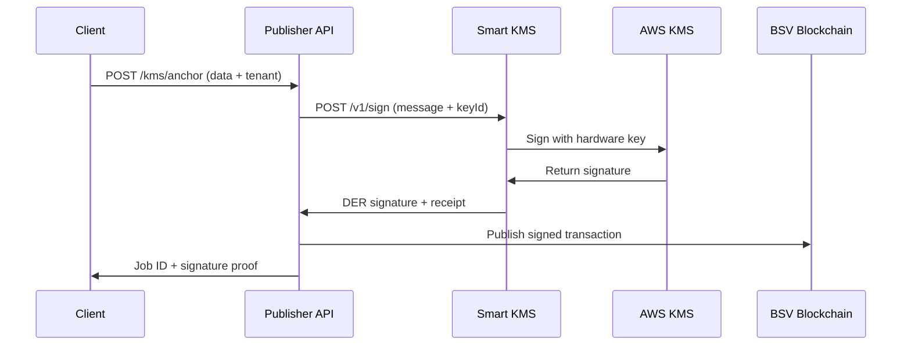

# BSV Publisher API - Developer Integration Guide
*Integrated with Smart KMS Hardware-Backed Signing*

## 🚀 Overview

The BSV Publisher API provides enterprise-grade Bitcoin SV blockchain publishing services with **Smart KMS integration** for hardware-backed cryptographic signing. Two distinct API endpoints:

1. **Regular Publishing API** (Port 3001) - High-volume general data publishing
2. **Smart KMS Signed API** (Port 3002) - Hardware-backed AWS KMS signatures with full audit trail

Both APIs integrate with our enterprise-scale UTXO management and **AWS KMS hardware security modules** system supporting 5,000+ transaction batches.

---

## 🌐 Base URLs

- **Production**: `https://api.smartkms.com` (Smart KMS) + `https://publisher-api.your-domain.com` (BSV Publisher)
- **Development**: 
  - Smart KMS: `http://localhost:8080`
  - BSV Publisher: `http://localhost:3001` (Regular) / `http://localhost:3002` (KMS-Signed)

---

## 📋 Table of Contents

1. [Regular Publishing API](#regular-publishing-api)
2. [Smart KMS Signed Publishing API](#smart-kms-signed-publishing-api)
3. [Smart KMS Integration](#smart-kms-integration)
4. [Authentication & Security](#authentication--security)
5. [Error Handling](#error-handling)
6. [Rate Limits](#rate-limits)
7. [Code Examples](#code-examples)
8. [SDKs & Libraries](#sdks--libraries)

---

## 🔄 Regular Publishing API

### Base URL: `http://localhost:3001`

### Endpoints

#### 1. Publish Data to BSV Blockchain

**POST** `/anchor`

Publishes JSON data to the Bitcoin SV blockchain.

**Request Body:**
```json
{
  "json": {
    "protocol": "YOUR_PROTOCOL",
    "data": "Your data here",
    "timestamp": "2025-01-08T12:00:00Z"
  },
  "metadata": {
    "useCase": "document|identity|contractual|other",
    "purpose": "Description of the data"
  },
  "webhook": "https://your-domain.com/webhook" // Optional
}
```

**Response (202 Accepted):**
```json
{
  "success": true,
  "jobId": "550e8400-e29b-41d4-a716-446655440000",
  "queuePosition": 0,
  "estimatedFee": 546,
  "estimatedConfirmation": "10-20 minutes",
  "message": "Job queued for processing"
}
```

#### 2. Check Job Status

**GET** `/status/{jobId}`

**Response (200 OK):**
```json
{
  "jobId": "550e8400-e29b-41d4-a716-446655440000",
  "status": "completed", // pending|processing|completed|failed
  "txid": "abc123...", // BSV transaction ID (when completed)
  "fee": 546,
  "confirmations": 3,
  "timestamp": "2025-01-08T12:00:00Z",
  "completedAt": "2025-01-08T12:05:00Z"
}
```

#### 3. Health Check

**GET** `/health`

**Response (200 OK):**
```json
{
  "status": "healthy",
  "services": {
    "redis": "connected",
    "utxoStore": "operational"
  },
  "queueLength": 5,
  "availableUTXOs": 4850
}
```

#### 4. Get Balance Information

**GET** `/balance`

**Response (200 OK):**
```json
{
  "superFundingBalance": 1.25000000,
  "fundingBalance": 0.05460000,
  "publishingUTXOs": 4850,
  "currency": "BSV"
}
```

---

## 🔐 Smart KMS Signed Publishing API

### Base URL: `http://localhost:3002`

The Smart KMS API integrates with AWS KMS hardware security modules for enterprise-grade cryptographic signing with full audit trails.

### Prerequisites

1. **Access to Smart KMS service** at `http://localhost:8080`
2. **Tenant ID** registered in Smart KMS system
3. **Key permissions** for your tenant's anchor/issue keys
4. **Network access** to AWS KMS endpoints

### Smart KMS Integration Flow



### Endpoints

#### 1. Publish with Smart KMS Signature

**POST** `/kms/anchor`

Publishes data signed with AWS KMS hardware-backed keys through Smart KMS integration.

**Request Body:**
```json
{
  "tenant": "PROD", // Your Smart KMS tenant ID
  "keyId": "anchor", // "anchor" or "issue" key
  "data": {
    "protocol": "SMART_KMS_SIGNED",
    "content": "Your content here",
    "timestamp": "2025-09-07T12:00:00Z"
  },
  "metadata": {
    "useCase": "document|identity|contractual",
    "purpose": "Hardware-signed document"
  },
  "webhook": "https://your-domain.com/webhook" // Optional
}
```

**Response (202 Accepted):**
```json
{
  "success": true,
  "jobId": "kms-550e8400-e29b-41d4-a716-446655440000",
  "queuePosition": 0,
  "estimatedFee": 546,
  "kmsSignature": {
    "algorithm": "ECDSA_SHA_256",
    "der": "3045022100...", // Hardware-backed signature
    "kid": "4d1451c6-d096-4b15-850b-98ab5c656548",
    "keyRef": "alias/bsv/tenant/PROD/anchor"
  },
  "auditTrail": {
    "receiptId": "01HJ8X7K2M3N4P5Q6R7S8T9V0W",
    "signedAt": "2025-09-07T12:00:00Z",
    "policyVersion": "1.0"
  },
  "message": "Hardware-signed job queued for processing"
}
```

#### 2. Check Smart KMS Job Status

**GET** `/kms/status/{jobId}`

**Response (200 OK):**
```json
{
  "jobId": "kms-550e8400-e29b-41d4-a716-446655440000",
  "status": "completed",
  "txid": "def456...",
  "kmsMetadata": {
    "tenant": "PROD",
    "keyId": "anchor",
    "signature": {
      "algorithm": "ECDSA_SHA_256",
      "der": "3045022100...",
      "kid": "4d1451c6-d096-4b15-850b-98ab5c656548",
      "keyRef": "alias/bsv/tenant/PROD/anchor"
    },
    "auditReceipt": {
      "receiptId": "01HJ8X7K2M3N4P5Q6R7S8T9V0W",
      "policyVersion": "1.0",
      "issuedAt": "2025-09-07T12:00:00Z"
    }
  },
  "fee": 546,
  "confirmations": 1
}
```

#### 3. Smart KMS API Health Check

**GET** `/kms/health`

**Response (200 OK):**
```json
{
  "status": "healthy",
  "services": {
    "redis": "connected",
    "smartKms": "operational",
    "awsKms": "available"
  },
  "kmsMetrics": {
    "activeTenants": 1,
    "hardwareKeys": 2,
    "signaturesCount": 1247
  },
  "kmsQueueLength": 0
}
```

---

## 🔗 Smart KMS Integration

### Direct Smart KMS API Access

You can also directly use Smart KMS for signing operations:

**Smart KMS Base URL**: `http://localhost:8080`

#### Sign with Smart KMS

**POST** `/v1/sign`

**Authentication Required**: API key in `X-API-Key` header

**Request:**
```json
{
  "tenant": "PROD",
  "keyId": "anchor",
  "message": "Hello BSV Blockchain!",
  "algorithm": "ECDSA_SHA_256"
}
```

**Headers:**
```
X-API-Key: your-api-key-here
Content-Type: application/json
```

**Response:**
```json
{
  "success": true,
  "requestId": "abc123",
  "signature": {
    "algorithm": "ECDSA_SHA_256",
    "der": "3045022100...",
    "kid": "4d1451c6-d096-4b15-850b-98ab5c656548",
    "keyRef": "alias/bsv/tenant/PROD/anchor"
  },
  "metadata": {
    "tenant": "PROD",
    "keyId": "anchor",
    "messageDigest": "sha256_hash_here",
    "timestamp": "2025-09-07T12:00:00Z"
  }
}
```

### Smart KMS Admin Endpoints

**⚠️ ADMIN AUTHENTICATION REQUIRED**: Admin API key required for all admin endpoints.

#### Get Key Information
**GET** `/v1/admin/keys`
- **Auth**: Admin API key required
- **Headers**: `X-API-Key: admin-key-here`

#### Get Signing Statistics  
**GET** `/v1/admin/stats`
- **Auth**: Admin API key required
- **Headers**: `X-API-Key: admin-key-here`

#### Get Recent Signatures
**GET** `/v1/admin/recent-signatures`
- **Auth**: Admin API key required
- **Headers**: `X-API-Key: admin-key-here`

---

## 🔑 Authentication & Security

### Regular API
- No authentication required
- Rate limited to 100 requests/minute per IP

### Smart KMS Signed API
- **Tenant ID required** in Smart KMS system
- **Hardware-backed signatures** via AWS KMS HSMs
- **Policy-based access control** with audit trails
- Rate limited to 30 requests/minute per IP
- All signatures generated by AWS hardware security modules

### Smart KMS Authentication
**🔐 API Key Authentication Required**

All Smart KMS endpoints require API key authentication:

**Headers Required:**
```
X-API-Key: your-api-key-here
Content-Type: application/json
```

**API Key Types:**
- **Admin Keys**: Full access to all endpoints including admin functions
- **User Keys**: Access to signing operations only

**Authentication Errors:**
- `401 Unauthorized`: Missing or invalid API key
- `403 Forbidden`: Insufficient permissions (e.g., user key accessing admin endpoints)

### Smart KMS Access Setup

**⚠️ AUTHENTICATION REQUIRED**: All Smart KMS endpoints now require API key authentication.

Configure your application to access Smart KMS:

```json
{
  "tenant": "PROD",
  "keyIds": ["anchor", "issue"],
  "smartKmsEndpoint": "https://api.smartkms.com",
  "awsRegion": "us-east-1",
  "apiKey": "your-api-key-here"
}
```

**Required Headers for All Requests:**
```
X-API-Key: your-api-key-here
Content-Type: application/json
```

**API Key Types:**
- **Admin Keys**: Access to all endpoints including `/v1/admin/*`
- **User Keys**: Access to signing endpoints only (`/v1/sign`, `/v1/sign/envelope`)

**Getting API Keys:**
Contact your Smart KMS administrator to obtain API keys for your tenant.

---

## ⚠️ Error Handling

### Common Error Codes

| Code | Status | Description |
|------|--------|-------------|
| `INVALID_JSON` | 400 | Malformed JSON in request body |
| `MISSING_REQUIRED_FIELDS` | 400 | Required fields missing |
| `UNAUTHORIZED` | 401 | Missing or invalid API key |
| `KMS_ACCESS_DENIED` | 401 | Invalid tenant or key access |
| `FORBIDDEN` | 403 | Insufficient permissions |
| `INVALID_TENANT` | 403 | Tenant not found in Smart KMS |
| `KMS_KEY_NOT_FOUND` | 404 | Smart KMS key not found |
| `JOB_NOT_FOUND` | 404 | Job ID not found |
| `RATE_LIMIT_EXCEEDED` | 429 | Too many requests |
| `KMS_SERVICE_ERROR` | 500 | Smart KMS service error |
| `INTERNAL_SERVER_ERROR` | 500 | Server error |

### Error Response Format

```json
{
  "error": "Error description",
  "code": "ERROR_CODE",
  "details": "Additional error details"
}
```

---

## 🚦 Rate Limits

- **Regular API**: 100 requests/minute per IP
- **Signed API**: 30 requests/minute per IP
- **Burst allowance**: 10 additional requests
- **Reset**: Every minute

Rate limit headers are included in responses:
```
X-RateLimit-Limit: 100
X-RateLimit-Remaining: 95
X-RateLimit-Reset: 1641648000
```

---

## 💻 Code Examples

### JavaScript/Node.js

#### Regular Publishing

```javascript
const fetch = require('node-fetch');

const publishData = async () => {
  const response = await fetch('http://localhost:3001/anchor', {
    method: 'POST',
    headers: { 'Content-Type': 'application/json' },
    body: JSON.stringify({
      json: {
        protocol: 'MY_APP_V1',
        data: 'Hello BSV Blockchain!',
        timestamp: new Date().toISOString()
      },
      metadata: {
        useCase: 'document',
        purpose: 'Test message'
      }
    })
  });
  
  const result = await response.json();
  console.log('Job ID:', result.jobId);
  
  // Check status
  const statusResponse = await fetch(`http://localhost:3001/status/${result.jobId}`);
  const status = await statusResponse.json();
  console.log('Status:', status);
};

publishData();
```

#### Smart KMS Hardware-Signed Publishing

```javascript
const fetch = require('node-fetch');

const publishWithSmartKMS = async () => {
  // Publish with hardware-backed Smart KMS signature
  const response = await fetch('http://localhost:3002/kms/anchor', {
    method: 'POST',
    headers: { 'Content-Type': 'application/json' },
    body: JSON.stringify({
      tenant: 'PROD',
      keyId: 'anchor',
      data: {
        protocol: 'SMART_KMS_SIGNED_V1',
        content: 'This document is signed by AWS KMS hardware',
        timestamp: new Date().toISOString()
      },
      metadata: {
        useCase: 'document',
        purpose: 'Hardware-signed document with audit trail'
      }
    })
  });
  
  const result = await response.json();
  console.log('Smart KMS Job ID:', result.jobId);
  console.log('Hardware Signature:', result.kmsSignature);
  console.log('Audit Receipt:', result.auditTrail);
  
  // Check status with Smart KMS metadata
  const statusResponse = await fetch(`http://localhost:3002/kms/status/${result.jobId}`);
  const status = await statusResponse.json();
  console.log('KMS Status:', status);
  console.log('Transaction ID:', status.txid);
  console.log('Hardware Key Used:', status.kmsMetadata.signature.kid);
};

publishWithSmartKMS();
```

#### Direct Smart KMS Signing

```javascript
const fetch = require('node-fetch');
const crypto = require('crypto');

const signWithSmartKMS = async () => {
  const message = 'Hello Smart KMS!';
  
  // Sign directly with Smart KMS (requires API key)
  const response = await fetch('https://api.smartkms.com/v1/sign', {
    method: 'POST',
    headers: { 
      'Content-Type': 'application/json',
      'X-API-Key': 'your-api-key-here'
    },
    body: JSON.stringify({
      tenant: 'PROD',
      keyId: 'anchor',
      message: message,
      algorithm: 'ECDSA_SHA_256'
    })
  });
  
  const result = await response.json();
  console.log('Smart KMS Response:', result);
  console.log('Hardware Signature (DER):', result.signature.der);
  console.log('KMS Key ID:', result.signature.kid);
  console.log('Message Digest:', result.metadata.messageDigest);
  
  // Verify the signature was generated by AWS KMS hardware
  console.log('Key Reference:', result.signature.keyRef);
};

signWithSmartKMS();
```

### Python

```python
import requests
import json
from datetime import datetime

def publish_data():
    """Regular publishing without signatures"""
    url = "http://localhost:3001/anchor"
    
    payload = {
        "json": {
            "protocol": "MY_APP_V1",
            "data": "Hello from Python!",
            "timestamp": datetime.utcnow().isoformat() + "Z"
        },
        "metadata": {
            "useCase": "document",
            "purpose": "Python test message"
        }
    }
    
    response = requests.post(url, json=payload)
    result = response.json()
    
    print(f"Job ID: {result['jobId']}")
    
    # Check status
    status_url = f"http://localhost:3001/status/{result['jobId']}"
    status_response = requests.get(status_url)
    status = status_response.json()
    
    print(f"Status: {status}")

def publish_with_smart_kms():
    """Publish with Smart KMS hardware-backed signatures"""
    url = "http://localhost:3002/kms/anchor"
    
    payload = {
        "tenant": "PROD",
        "keyId": "anchor",
        "data": {
            "protocol": "SMART_KMS_PYTHON_V1",
            "content": "Python document signed by AWS KMS hardware",
            "timestamp": datetime.utcnow().isoformat() + "Z"
        },
        "metadata": {
            "useCase": "document",
            "purpose": "Python Smart KMS integration test"
        }
    }
    
    response = requests.post(url, json=payload)
    result = response.json()
    
    print(f"Smart KMS Job ID: {result['jobId']}")
    print(f"Hardware Signature: {result['kmsSignature']['der'][:50]}...")
    print(f"KMS Key ID: {result['kmsSignature']['kid']}")
    print(f"Audit Receipt: {result['auditTrail']['receiptId']}")

def direct_smart_kms_sign():
    """Direct Smart KMS signing with authentication"""
    url = "https://api.smartkms.com/v1/sign"
    headers = {
        'Content-Type': 'application/json',
        'X-API-Key': 'your-api-key-here'
    }
    
    payload = {
        "tenant": "PROD",
        "keyId": "anchor", 
        "message": "Python message for Smart KMS",
        "algorithm": "ECDSA_SHA_256"
    }
    
    response = requests.post(url, json=payload, headers=headers)
    result = response.json()
    
    print(f"Smart KMS Signature: {result['signature']['der']}")
    print(f"Hardware Key: {result['signature']['kid']}")
    print(f"Message Digest: {result['metadata']['messageDigest']}")

# Run examples
publish_data()
publish_with_smart_kms()
direct_smart_kms_sign()
```

### cURL

```bash
# Regular publishing
curl -X POST http://localhost:3001/anchor \
  -H "Content-Type: application/json" \
  -d '{
    "json": {
      "protocol": "CURL_TEST_V1",
      "data": "Hello from cURL!",
      "timestamp": "2025-09-07T12:00:00Z"
    },
    "metadata": {
      "useCase": "document",
      "purpose": "cURL test"
    }
  }'

# Smart KMS hardware-signed publishing
curl -X POST http://localhost:3002/kms/anchor \
  -H "Content-Type: application/json" \
  -d '{
    "tenant": "PROD",
    "keyId": "anchor",
    "data": {
      "protocol": "SMART_KMS_CURL_V1",
      "content": "cURL document signed by AWS KMS hardware",
      "timestamp": "2025-09-07T12:00:00Z"
    },
    "metadata": {
      "useCase": "document",
      "purpose": "cURL Smart KMS test"
    }
  }'

# Direct Smart KMS signing (requires API key)
curl -X POST https://api.smartkms.com/v1/sign \
  -H "Content-Type: application/json" \
  -H "X-API-Key: your-api-key-here" \
  -d '{
    "tenant": "PROD",
    "keyId": "anchor",
    "message": "Hello Smart KMS from cURL!",
    "algorithm": "ECDSA_SHA_256"
  }'

# Check job status
curl http://localhost:3001/status/YOUR_JOB_ID

# Check Smart KMS job status  
curl http://localhost:3002/kms/status/YOUR_KMS_JOB_ID

# Health checks (no authentication required)
curl https://api.smartkms.com/health
curl https://api.smartkms.com/v1/health

# Smart KMS admin endpoints (require admin API key)
curl -H "X-API-Key: admin-key-here" https://api.smartkms.com/v1/admin/keys
curl -H "X-API-Key: admin-key-here" https://api.smartkms.com/v1/admin/stats
curl -H "X-API-Key: admin-key-here" https://api.smartkms.com/v1/admin/recent-signatures
```

---

## 📚 SDKs & Libraries

### Recommended Libraries

#### For BSV Operations
- **JavaScript**: `bsv` - Full BSV library with ECDSA support
- **Python**: `bitcoinx` - Bitcoin SV library for Python  
- **Go**: `go-bsv` - BSV library for Go applications
- **Java**: `bitcoinj-sv` - Bitcoin SV library for Java

#### For Smart KMS Integration
- **AWS SDK**: Required for direct KMS access (optional with Smart KMS service)
- **HTTP Clients**: Any standard HTTP client for REST API calls
- **JSON Libraries**: For request/response handling

### Smart KMS Integration Example

```javascript
// Smart KMS + BSV Publisher Integration
const fetch = require('node-fetch');

class SmartKMSPublisher {
  constructor(smartKmsUrl, publisherUrl, tenant, apiKey) {
    this.smartKmsUrl = smartKmsUrl;
    this.publisherUrl = publisherUrl;
    this.tenant = tenant;
    this.apiKey = apiKey;
  }
  
  async signAndPublish(data, keyId = 'anchor') {
    // Step 1: Sign with Smart KMS hardware (requires API key)
    const signResponse = await fetch(`${this.smartKmsUrl}/v1/sign`, {
      method: 'POST',
      headers: { 
        'Content-Type': 'application/json',
        'X-API-Key': this.apiKey
      },
      body: JSON.stringify({
        tenant: this.tenant,
        keyId: keyId,
        message: JSON.stringify(data),
        algorithm: 'ECDSA_SHA_256'
      })
    });
    
    const signResult = await signResponse.json();
    
    // Step 2: Publish to BSV with hardware signature
    const publishResponse = await fetch(`${this.publisherUrl}/kms/anchor`, {
      method: 'POST',
      headers: { 'Content-Type': 'application/json' },
      body: JSON.stringify({
        tenant: this.tenant,
        keyId: keyId,
        data: data,
        metadata: {
          useCase: 'document',
          purpose: 'Hardware-signed blockchain publishing'
        }
      })
    });
    
    const publishResult = await publishResponse.json();
    
    return {
      jobId: publishResult.jobId,
      signature: signResult.signature,
      auditTrail: publishResult.auditTrail,
      estimatedFee: publishResult.estimatedFee
    };
  }
  
  async getJobStatus(jobId) {
    const response = await fetch(`${this.publisherUrl}/kms/status/${jobId}`);
    return await response.json();
  }
}

// Usage
const publisher = new SmartKMSPublisher(
  'https://api.smartkms.com',
  'http://localhost:3002', 
  'PROD',
  'your-api-key-here'
);

const result = await publisher.signAndPublish({
  protocol: 'MY_APP_V1',
  content: 'Hardware-signed document',
  timestamp: new Date().toISOString()
});

console.log('Published with hardware signature:', result);
```

---

## 🔧 Integration Checklist

### For Regular API Integration:
- [ ] Implement error handling for all API calls
- [ ] Add retry logic for failed requests
- [ ] Monitor rate limits in your application
- [ ] Set up webhook endpoints for job completion notifications
- [ ] Test with various data sizes and formats

### For Smart KMS Integration:
- [ ] Configure access to Smart KMS service endpoint
- [ ] **Obtain valid API key from Smart KMS administrator**
- [ ] **Test authentication with API key headers**
- [ ] Obtain valid tenant ID from Smart KMS administrator
- [ ] Test connectivity to AWS KMS through Smart KMS service
- [ ] Implement error handling for hardware signing operations
- [ ] **Handle authentication errors (401/403) appropriately**
- [ ] Set up monitoring for Smart KMS audit trails
- [ ] Test with both anchor and issue keys
- [ ] **Verify API key permissions match your use case**
- [ ] Verify signature formats are compatible with your use case

### Production Deployment Checklist:
- [ ] Smart KMS service running on `https://api.smartkms.com`
- [ ] BSV Publisher API configured with Smart KMS integration
- [ ] Network connectivity between services established
- [ ] Rate limiting configured for production traffic
- [ ] Monitoring and alerting set up for both services
- [ ] Backup procedures for audit trails and receipts

---

## 🆘 Support & Troubleshooting

### Common Issues

1. **"UNAUTHORIZED" (401)**
   - Missing API key in X-API-Key header
   - Invalid API key format
   - API key not found in system

2. **"FORBIDDEN" (403)**
   - User API key attempting to access admin endpoints
   - Insufficient permissions for requested operation
   - API key expired or disabled

3. **"KMS_ACCESS_DENIED"**
   - Verify tenant ID is correct
   - Check Smart KMS service is running
   - Ensure network connectivity to AWS KMS

4. **"INVALID_TENANT"**
   - Confirm tenant exists in Smart KMS system
   - Check tenant permissions for key access
   - Verify Smart KMS configuration

3. **"KMS_KEY_NOT_FOUND"**
   - Verify keyId is "anchor" or "issue"
   - Check Smart KMS key aliases are configured
   - Ensure AWS KMS keys exist and are enabled

4. **"RATE_LIMIT_EXCEEDED"**
   - Implement exponential backoff
   - Distribute requests over time
   - Consider upgrading rate limits if needed

5. **"JOB_NOT_FOUND"**
   - Verify job ID format
   - Check if job has expired (24-hour TTL)

6. **"KMS_SERVICE_ERROR"**
   - Check Smart KMS service health at `/v1/health`
   - Verify AWS KMS service availability
   - Review Smart KMS logs for detailed errors

### Debug Mode

Add `?debug=true` to any endpoint for additional debugging information:

```bash
# Regular API debug
GET /health?debug=true

# Smart KMS debug
GET /kms/health?debug=true
GET /v1/health?debug=true  # Direct Smart KMS
```

### Smart KMS Integration Testing

Test your Smart KMS integration with authentication:

```bash
# Test Smart KMS connectivity (no auth required)
curl https://api.smartkms.com/v1/health

# Test authenticated access (requires API key)
curl -X POST https://api.smartkms.com/v1/sign \
  -H "Content-Type: application/json" \
  -H "X-API-Key: your-api-key-here" \
  -d '{"tenant":"PROD","keyId":"anchor","message":"test"}'

# Test admin access (requires admin API key)
curl -H "X-API-Key: admin-key-here" https://api.smartkms.com/v1/admin/keys
```

### Contact Information

- **Technical Support**: [Your support email]
- **API Documentation**: [Your docs URL]
- **Status Page**: [Your status page URL]

---

## 📈 Performance Guidelines

### Batch Processing
- For high-volume publishing, use the regular API for unsigned data
- Use Smart KMS signed API for critical data requiring hardware-backed provenance
- Consider implementing client-side queuing for Smart KMS operations
- Monitor UTXO pool levels via `/balance` endpoint

### Optimization Tips
- Cache job status responses when appropriate
- Use webhooks instead of polling for job completion
- Implement connection pooling for high-frequency requests
- Use Smart KMS signing only for data requiring hardware-backed security
- Consider tenant-based key rotation policies
- Monitor Smart KMS audit trails for compliance requirements

### Smart KMS Performance
- Hardware signing latency: ~100-200ms per operation
- Concurrent signing: Supported via AWS KMS scaling
- Audit trail storage: Automatic in DynamoDB
- Key rotation: Managed through AWS KMS

---

*Last Updated: September 10, 2025*  
*API Version: 2.2.0 - Smart KMS Authentication*  
*Smart KMS Service: Production Ready with API Key Authentication*
